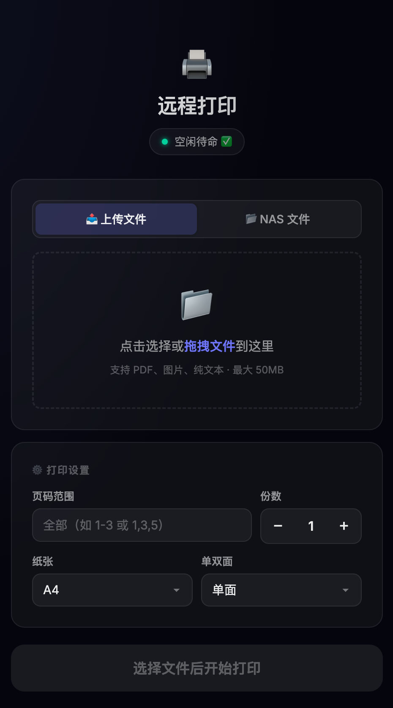

# CupsAutoPrinter - NAS 远程打印 Web 服务

把 NAS 变成打印服务器，手机/电脑打开网页就能打印。不用装驱动，不用插 U 盘，不用把文件传来传去。

## 这是什么

一个跑在 NAS Docker 上的轻量 Web 应用，对接同 NAS 上的 CUPS 打印服务。浏览器打开页面，选文件，点打印，完事。三个容器各管一摊：CUPS 干打印活的底层，Flask 管网页交互，Nginx 套一层 HTTPS 给 iPhone 用。

**适合谁用：**
- NAS 上已经跑着 CUPS 打印服务的人
- 想用手机直接打印 NAS 里文件的人
- 受够了"传文件到电脑 → 连数据线 → 打印"这条老路的人
- **喷墨打印机长期不开会堵头**的人（本项目自带防堵自动打印）

## 功能

- **上传打印**：从手机/电脑上传文件，直接打印
- **NAS 本地文件打印**：浏览 NAS 目录，选文件直接打印，不用上传
- **PDF 缩略图预览**：上传的 PDF 用 pdf.js 客户端渲染，NAS 本地 PDF 用 PyMuPDF 后端渲染
- **全屏灯箱查看**：点缩略图放大查看，支持触摸滑动翻页
- **页码范围打印**：指定打印哪几页（如 `1-3,5,8-10`）
- **打印选项**：份数、单双面、纸张大小（A4/A3/A5/Letter/Legal 等）
- **打印状态查询**：实时查看打印机状态和打印队列
- **取消打印任务**：一键取消队列中的任务
- **iPhone HTTPS 支持**：自签证书 + Nginx 反代，解决 iOS Safari 强制 HTTPS 升级问题
- **🖨️ 浏览器标签图标**：纯 SVG emoji favicon，零外部依赖，标签栏一眼认出
- **喷头防堵倒计时**：网页顶部显示「距上次打印已过 X 天」，绿/黄/红三色状态
- **喷头防堵自动打印**：超过 7 天没打印，自动随机打一张防堵头 PDF 并 Bark 推送到手机

**支持的文件格式：**
PDF、PNG、JPG、JPEG、GIF、BMP、TIFF、TXT、PS、EPS、WebP

## 截图



> 主界面：深色主题、拖拽上传、打印设置一目了然。顶部还有喷头防堵倒计时卡片。

## 快速开始

### 前置条件

1. **Docker + Docker Compose** 已安装
2. 一台通过 USB 连在 NAS 上的打印机（CUPS 会接管它）
3. 本项目的 `cups2` 容器自带 CUPS 服务，无需你提前装

### 部署步骤

```bash
# 1. 克隆项目
git clone https://github.com/simble-wang/webcupsprinter.git
cd webcupsprinter

# 2. 改配置（必改三项）
vi docker-compose.yml
```

**必须修改的配置：**

| 配置项 | 位置 | 说明 |
|--------|------|------|
| `/your/nas/path` | docker-compose.yml volumes（print-web） | 改成你 NAS 上要浏览的文件目录 |
| `YourPrinterName` | docker-compose.yml environment（print-web） | 改成 CUPS 里的打印机名（`docker exec cups2 lpstat -p` 查看） |
| `SAN_IPS` | docker-compose.yml environment（nginx） | 改成你 NAS 的 IP 地址（所有你打算用来访问的 IP） |

**SAN_IPS 示例：**
```yaml
# 局域网访问
- SAN_IPS=IP:127.0.0.1,IP:192.168.1.100

# 局域网 + Tailscale 远程访问
- SAN_IPS=IP:127.0.0.1,IP:192.168.1.100,IP:100.x.x.x
```

```bash
# 3. 启动（会自动构建 print-web 和 nginx 镜像，并拉取 cups2 镜像）
docker compose up -d --build

# 4. 验证
curl http://localhost:5000/          # Flask 直连
curl -k https://localhost:8443/      # Nginx HTTPS
```

浏览器打开 `http://你的NAS_IP:5000` 即可使用。

## 访问方式

| 平台 | 推荐访问方式 | 说明 |
|------|-------------|------|
| Mac / Windows / Linux | `http://NAS_IP:5000` | HTTP 直连 Flask |
| Android | `http://NAS_IP:5000` | HTTP 直连 Flask |
| iPhone / iPad | `https://NAS_IP:8443` | **必须走 HTTPS**（iOS Safari 会强制升级） |

### 为什么 iPhone 必须走 HTTPS？

iOS Safari 对 IP 地址会自动尝试 HTTPS 升级。如果只提供 HTTP 服务，Safari 会把页面当成文件下载（出现"下载 document"的怪事）。所以专门用 Nginx 反代套了一层 HTTPS。

## iPhone HTTPS 证书信任设置（重要！）

Nginx 使用自签名证书，iPhone 需要手动信任。证书由 `nginx/entrypoint.sh` 首次启动时自动生成（含你配置的 SAN IP），生成一次后会持久化在 `./certs` 目录，重启不会变。

### 步骤

1. **下载证书**
   Safari 打开：`https://你的NAS_IP:8443/api/download-cert`

2. **安装描述文件**
   设置 → 通用 → VPN与设备管理 → 已下载描述文件 → 安装

3. **开启信任（最容易漏的一步！）**
   设置 → 通用 → 关于本机 → 证书信任设置 → 把开关打开

4. **访问**
   Safari 打开 `https://你的NAS_IP:8443`

> 如果之前装过旧证书，先在"VPN与设备管理"里删掉旧的，再装新的。
> 如果 Safari 缓存了旧的拒绝状态，去 设置 → Safari → 清除历史记录与网站数据。

## 架构

```
                    ┌─────────────┐
  浏览器/手机  ────→ │   Nginx     │ :8443 (HTTPS, 自签证书)
                    │  (反代+SSL)  │
                    └──────┬───────┘
                           │ proxy_pass
                    ┌──────▼───────┐
                    │   Flask App  │ :5000 (HTTP)
                    │  (打印逻辑)   │
                    └──────┬───────┘
                           │ lp / lpstat 命令
                    ┌──────▼───────┐
                    │    CUPS      │ :631 (ydkn/cups 容器)
                    │  (打印服务)   │
                    └──────┬───────┘
                           │ USB
                    ┌──────▼───────┐
                    │   打印机      │
                    └──────────────┘
```

**三个容器：**
- `cups2`：CUPS 打印服务（ydkn/cups 镜像），接管 USB 打印机，提供 `lp` / `lpstat` 命令行接口
- `print-web`：Flask 应用，处理打印逻辑、文件浏览、缩略图渲染、防堵头倒计时
- `print-proxy`：Nginx 反向代理，提供 HTTPS（主要给 iPhone 用）

三个容器都用 `network_mode: host`，所以 Nginx 能直连 `localhost:5000`，Flask 能直连 `localhost:631`。

## 喷头防堵自动打印

喷墨打印机长期不用，墨水会干在喷头里堵死。解决办法很简单：**定期随便打一张**。本功能帮你自动盯着。

### 工作原理

1. 网页顶部实时显示「距上次打印已过 X 天」的倒计时（服务端渲染，刷新页面立即可见）
2. 每天 10:00 的 cron 任务跑 `anti-clog.sh`，查 CUPS 最近一次完成打印的时间
3. 如果距今 **超过 7 天**，随机选一张防堵头 PDF 自动打印
4. 打印成功后通过 **Bark** 推送到手机：「防堵头工具已运行并打印」
5. 打印失败则推送：「打印失败: xxx 原因」，方便你排查（打印机没纸/没墨/离线）

### 配置步骤

**1. 准备两张防堵头 PDF**（内容随便，纯色块/测试页都行），放到 NAS 某目录，例如：
```
/your/nas/path/AForprinter/打印防堵头儿文案.pdf
/your/nas/path/AForprinter/打印防堵头儿文案2.pdf
```

**2. 改 `anti-clog.sh` 里的路径和 Bark key：**
```bash
FILE1="/your/nas/path/AForprinter/打印防堵头儿文案.pdf"
FILE2="/your/nas/path/AForprinter/打印防堵头儿文案2.pdf"
BARK_KEY="你的BarkKey"        # 或者用环境变量 BARK_KEY 传入，避免写在脚本里
```

**3. 加到 root 的 crontab：**
```bash
sudo crontab -e
# 每天 10:00 检查一次
0 10 * * * /path/to/anti-clog.sh
```

> 阈值（`THRESHOLD_DAYS`）、打印机名（`PRINTER`）、CUPS 容器名（`CUPS_CONTAINER`）都在 `anti-clog.sh` 顶部配置区，按需改。

### 注意事项

- 脚本通过 `docker exec cups2 lpstat -W completed -o` 查打印记录，CUPS 输出按任务号降序，取第一行即最近一次打印，逻辑无误
- 如果打印机关机/没纸，`lp` 命令仍会"成功排队"但打不出来，Bark 会误报"已打印"，且次日 cron 会再次触发——这是 CUPS 异步打印的固有限制，使用前确认打印机在线有墨

## 配置说明

### 环境变量

| 变量 | 默认值 | 说明 |
|------|--------|------|
| `PRINTER_NAME` | YourPrinterName | CUPS 中的打印机名 |
| `CUPS_SERVER` | localhost:631 | CUPS 服务地址 |
| `LOCAL_FILES_DIR` | /nas_files | 容器内 NAS 文件挂载路径 |
| `SAN_IPS` | IP:127.0.0.1,... | SSL 证书的 SAN IP 列表 |
| `UPLOAD_DIR` | /tmp/print_uploads | 上传文件临时目录 |
| `SSL_CERT_PATH` | /tmp/certs/cert.pem | SSL 证书路径（供 iPhone 下载） |

### 文件清理

上传的文件会在 1 小时后自动删除，每 10 分钟扫描一次，不会撑爆硬盘。

## 更新证书

如果 NAS IP 变了，或需要重新生成证书：

```bash
# 1. 改 docker-compose.yml 里的 SAN_IPS
# 2. 删旧证书
rm -rf certs/*
# 3. 重建 nginx 容器
docker compose up -d --force-recreate nginx
# 4. iPhone 重新下载安装证书
```

## 常见问题

**Q: 打印机连不上？**
确认 cups2 容器在跑：`docker ps | grep cups2`，确认 `docker exec cups2 lpstat -p` 能看到打印机。

**Q: iPhone 提示"无法连接到服务器"？**
1. 确认 Tailscale/网络通了
2. 确认证书信任开关打开了（设置 → 通用 → 关于本机 → 证书信任设置）
3. 清除 Safari 缓存重试

**Q: iPhone 访问 HTTP 下载了 document 文件？**
这是 iOS Safari 的 HTTPS 强制升级机制。iPhone 上只用 `https://NAS_IP:8443`，别用 HTTP。

**Q: Mac/安卓提示证书不安全？**
自签证书正常现象。Mac 上点"高级"→"继续访问"即可；安卓点"详细信息"→"继续访问"。

**Q: 缩略图加载慢？**
大 PDF 渲染需要时间。上传模式用 pdf.js 客户端渲染（不占服务器资源），NAS 本地文件用 PyMuPDF 后端渲染。

**Q: 想改端口？**
改 `nginx/nginx.conf` 里的 `listen 8443` 和 `docker-compose.yml` 里对应的配置。

**Q: 防堵头倒计时一直显示"正在查询打印记录"？**
页面用了服务端渲染兜底，正常应直接显示剩余天数。若卡在查询态，多半是浏览器缓存了旧页面，强刷（Ctrl/Cmd+Shift+R）即可；或检查 Flask 能否连上 `localhost:631` 的 CUPS。

## 技术栈

- **后端**：Flask 3.1.1 + PyMuPDF（PDF 渲染）
- **前端**：pdf.js 3.11.174（CDN）+ 原生 JS
- **打印**：CUPS（ydkn/cups 镜像，lp / lpstat / cancel 命令行工具）
- **HTTPS**：Nginx（nginx:alpine）+ OpenSSL 自签证书
- **Docker**：python:3.11-slim + nginx:alpine
- **推送**：Bark（防堵头打印通知）

## 限制

- 无用户认证（**不要暴露到公网**，仅限内网/Tailscale 使用）
- 上传文件最大 50MB
- 路径穿越防护（无法通过 `../../../` 访问 NAS 挂载目录之外的文件）

## License

MIT
